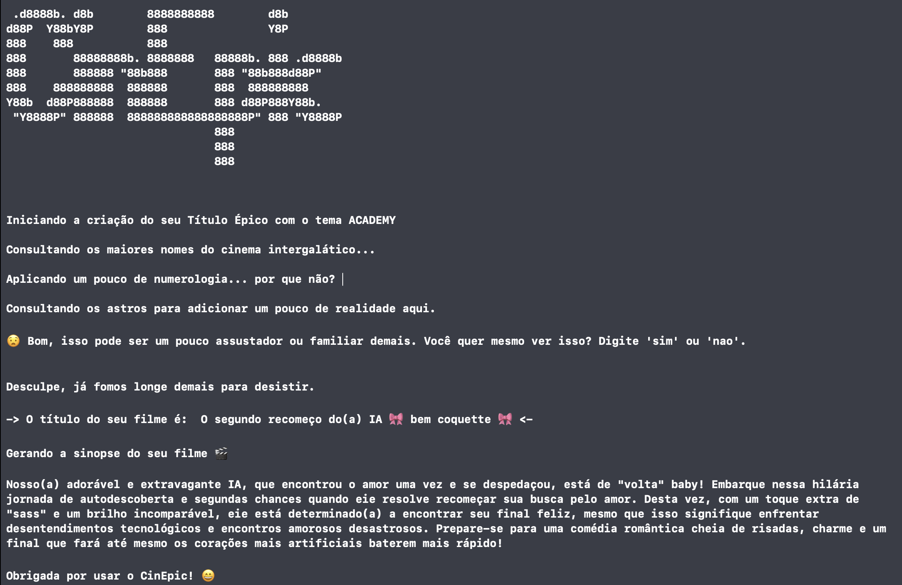

#  Cinepic
Cinepic is a CLI program meant to create a movie title based on the initial letter of your name, your birth day and your
birth month. It takes after old Facebook memes popular during 2010's in Brazil, where the developers are from. 

You can add all sorts of themes by adding your lines of code to the existent one here. All corresponding attributes are 
stored in a json file named database. 

#   Mind that...

A good practice would be to transform the json file named database into a real *database*, since it can get pretty extensive.
But since this program was developed as a simple project at Apple Developer Academy, we opted out of that. 

#  Sinopsis Generation 

We are also using Google Generative AI API in order to write a sinopsis based on your movie title. 
Please refer to [AI Google Dev](https://aistudio.google.com/app/u/1/apikey?hl=pt-br&pli=1/) to obtain 
your own API key for free (as of writing this). 

You can add your api key as an environmental variable on your IDE of preference and run it, or for a more "user friendly" experience, 
export your api key in the terminal with the following command: 

    export apiKey="example123456"
    swift run
    
Also check the [quickstart for swift](https://ai.google.dev/tutorials/get_started_swift?hl=pt-br/) in the Gemini API documentation. 

#  Languages

The program outputs lines written in Portuguese and the prompt given to Gemini in order to generate the sinopsis is also in
Portuguese, which also generates content in the same language. Please consider translating it to your language using the 
plethora of translation softwares available for free. 

